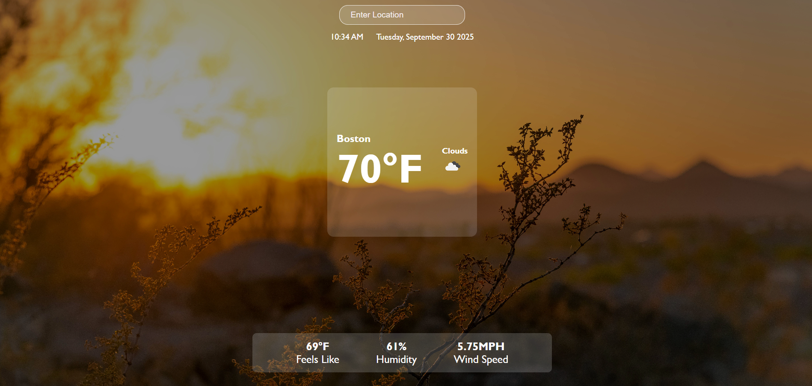

# Weather App

# Description
This Weather application takes in a city location and uses Open Weather API to tell you the temperature and weather details.

## Weather Components
- Enter city to get current weather details from weather APP
- Open Weather API gives name of City, current temperature, weather details, and icon
- More weather details on the very bottom 

## Lessons
- Use of React, node.js, npm
- Learning root
- Deploying on domain
- Estabilish DOM elements
- Use data grabbing from API to display on APP

## How to Use
To use this weather app, follow these steps: 

- Clone the repository: git clone https://github.com/WinnieYuDev/weather-app.git 
- Navigate to the app directory in terminal: cd app 
- Install dependencies in terminal: npm install 
- Run the app by pasting this into the terminal: npm run dev 
- Open your browser and navigate to [http://localhost:3000/](http://localhost:3000/)

# Notes
Link to API: https://openweathermap.org/api

# Future Updates
- Welcome Pop up animation for user experience
- Adding feature that updates background of app to change to what the current weather is
- Air quality index based on Real time Air quality API: https://aqicn.org/api
